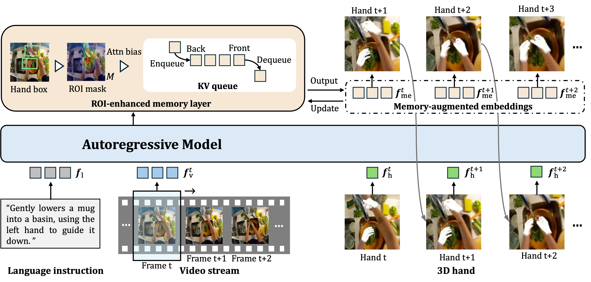

# **SFHand: A Streaming Framework for Language-guided 3D Hand Forecasting and Embodied Manipulation**

[](https://arxiv.org/pdf/2511.18127)
[](https://huggingface.co/datasets/ut-vision/EgoHaFL)
[](https://huggingface.co/ut-vision/SFHand)

---

## 🔥 **Project Highlights**

| Feature                      | Description                                      |
| ---------------------------- | ------------------------------------------------ |
| 📡 **Streaming Framework**   | Autoregressive multi-modal hand forecasting      |
| ✋ **Full-State Predictions** | Hand type, 2D box, 3D pose, and trajectory       |
| 🧠 **ROI-Enhanced Memory**     | Temporal hand awareness        |
| 🗣️ **Language-guided**      | Follows natural language instructions            |
<!-- | 🤖 **Embodied Ready**        | Downstream manipulation support (Franka Kitchen) | -->

---

## 🎬 **Method Overview**



---

## 📝 **Introduction**

> 💡 **SFHand is the first streaming architecture for language-guided 3D hand forecasting.**

SFHand predicts future hand dynamics from continuous egocentric video + text instructions.
The model outputs the following hand states *autoregressively*: Hand type, 2D bounding box, 3D hand pose, and 3D trajectory

Key components: Streaming autoregressive transformer and ROI-enhanced memory.

---

## 📦 **Project Status**

| Component                            | Status         |
| ------------------------------------ | -------------- |
| EgoHaFL Dataset                      | ✅              |
| Pretraining Code                     | ✅              |
| Pretrained Weights                   | ✅              |
| Evaluation Code                      | ✅              |
| Embodied Evaluation (Franka Kitchen) | 🔜 Coming soon |

---

## 🔧 **Installation**

```bash
git clone git@github.com:ut-vision/SFHand.git
conda env create -f environment.yml
conda activate sfhand
pip install -r requirements.txt
conda install -c conda-forge libgl
```

Download [MANO model](https://mano.is.tue.mpg.de/) and put `MANO_LEFT.pkl` and `MANO_RIGHT.pkl` under `data/mano`.

---

## 📂 **Dataset: EgoHaFL**

EgoHaFL Dataset (annotations)：
👉 [https://huggingface.co/datasets/ut-vision/EgoHaFL](https://huggingface.co/datasets/ut-vision/EgoHaFL)

Videos originate from Ego4D V1: [https://ego4d-data.org/](https://ego4d-data.org/).
We use **224p compressed clips**.

Directory structure:

```
EgoHaFL
    ├── EgoHaFL_lmdb
    │   ├── data.mdb
    │   └── lock.mdb
    ├── EgoHaFL_train.csv
    ├── EgoHaFL_test.csv
    └── v1
        └── videos_224p
```

---

## 🚀 **Training & Evaluation**

### **Train + Eval**

```bash
bash ./exps/pretrain.sh
```

> ⚠️ Before training, edit configs in `./configs`.

### **Eval + Visualization**

```bash
python main.py --config_file configs/config/clip_base_eval.yml --eval --vis
```

Output visualizations → `./render_results/`

---

## 🧠 **Pretrained Models**

Download here:

👉 [https://huggingface.co/ut-vision/SFHand](https://huggingface.co/ut-vision/SFHand)

---

## 🤖 **Embodied Evaluation (Franka Kitchen)**

> ⏳ Coming soon — code will be added once finalized.

---

## 📚 **Citation**

```latex
@article{liu2025sfhand,
  title={SFHand: A Streaming Framework for Language-guided 3D Hand Forecasting and Embodied Manipulation},
  author={Liu, Ruicong and Huang, Yifei and Ouyang, Liangyang and Kang, Caixin and and Sato, Yoichi},
  journal={arXiv preprint arXiv:2511.18127},
  year={2025}
}
```

---

## 🙏 **Acknowledgement**

SFHand builds on **[EgoHOD](https://github.com/InternRobotics/EgoHOD)**.
Thanks to all contributors of the original codebase.

